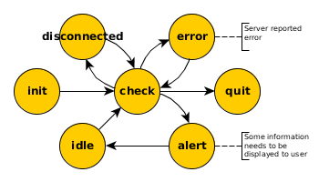

Internal states
===============

Internally there are seven internal states, one of which the the application is in at any given time during execution:

INIT
  Application is initialised.

IDLE (default)
  The application is waiting for some predefined time.

CHECK
  Information from server is requested.

DISCONNECTED
  No connection to the server can be established. In regular intervals, which are not as frequent as in IDLE, the state will be changed back to CHECK to check for recovered connectivity.

ALERT
  A change to the state of one or more games has been found of which the user 
  will be notified.

ERROR
  A non-recoverable error has occurred. User intervation is necessary.

QUIT
  Application is exiting.

State changes
-------------

The rules for progressing from one state to the other are as follows:

INIT |arrow| CHECK:
  application is initialised

CHECK |arrow| DISCONNECTED:
  no connection to service

CHECK |arrow| ALERT:
  a change in one (or several) of the user's games was found that requires
  action from the user

CHECK |arrow| ERROR:
  non-recoverable error which requires user intervation

  Examples:

  * authentication error
  * IOError while trying to read/write config

ALERT |arrow| IDLE:
  1. user has reacted to notification
  2. games' states changed in the mean-time making user interaction unnecessary

ERROR |arrow| CHECK:
  (all) existing errors have been solved

The following two transitions will both happen after a predefined time:

IDLE |arrow| CHECK:
  try again after `POLLING INTERVAL` seconds

DISCONNECTED |arrow| CHECK:
  try again after some penalty period

.. |arrow| unicode:: U+02192 .. RIGHTWARDS ARROW

